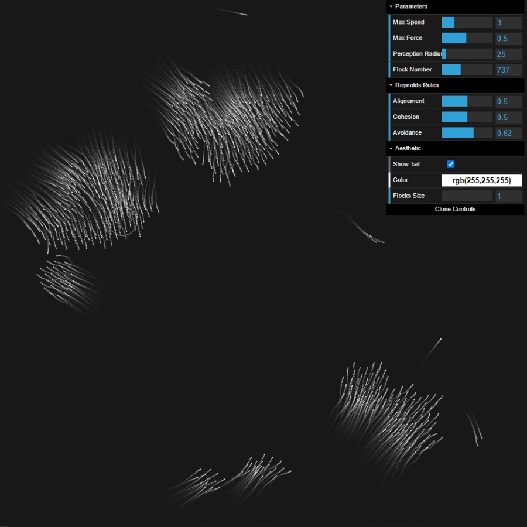

# Flocks-Simulations
Flocks Simulation based on the Reynolds's Rules

Interface            
:-------------------------:
    

## Build With

Any additional information goes here

- JavaScript
    - JQuery
    - DatGui
    - StatsJS
- Html
- CSS

## Demo

Demonstration gifs
Gif #1                     |  Gif #2     
:-------------------------:|:-------------------------:
       |  

 

